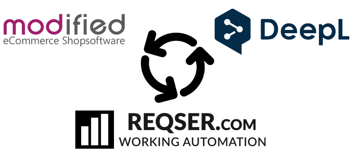

# Reqser.com Modified Modul

## Einleitung

Dieses Modul verbindet den Modified Shop mit einer API Schnittstelle zu Reqser.com und zum Deepl Translater. Das Modul managed alle Fremdsprachen in der Datenbank und den Sprachfiles, es werden automatisch alle texte in alle aktivierten Fremdsprachen übersetzt. Der Shopbetreiber muss also nur noch in seiner Muttersprache Texte erstellen, alle anderen Sprachen übernimmt Reqser.

Über Reqser können die Texte angepasst werden, eine Wörterbuch für zukünftig verbesserte Übersetzungen erstellt oder ein Übersetzer beauftragt werden, die automatisch generierten Texte zu kontrollieren und korrigieren.

## Installation
### 1. Reqser.com

Eine detailierte Installationsanleitung im PDF Format finden Sie [hier](https://github.com/reqsercom/reqser_modified_module/blob/main/Installationsanleitung_de.pdf).
Registrieren dich bei Reqser.com [hier](https://www.reqser.com/register) und erstelle/kopiere dein API Key [hier](https://www.reqser.com/translation/new-website/Modified).

### 2. Modified Modul

Lade alle Dateien aus dem Shoproot (Achtung Admin Ordner muss ggf. umbenennt werden gemäss Ihrem Shop Admin Ordner) in dein Modified Shop und installiere das Modul unter "Systemmodule".
Trage den API Key ein, definiere deine Muttersprache von welcher übersetzt werden soll und definiere die Sprachen in welche du die Übersetzung möchtest.

### 3. Verbindungs Test

Schliesse die Verbindung in Reqser.com ab und prüfe ob die Verbindung erfolgreich war.

### 4. Live Modus

Im Live Modus werden sämtliche Fremdsprach Texte durch das Modul übernommen, der Shopbetreiber muss nur noch in seiner Grundsprache arbeiten.

## Weitere technische Informationen

Es ist möglich beliebig viele weitere Tabellen zu übersetzten, jedoch nur wenn im Modified Modul die entsprechende Tabelle freigegeben wird. Sobald die Tabelle im Modul freigegeben ist kann die neue Tabelle unter weitere Einstellungen hinzugefügt werden.
Ebenfalls ist es möglich weitere Spalten die nicht standardmässig aktiviert sind zu übersetzten, dazu ebenfalls enstprechend die Einstellungen bei Reqser nutzen.

Ebenfalls können die Sprachdateien mit übersetzt werden, alle Dateien in der Muttersprache werden übersetzt in den Shop übertrage.

Es ist nicht möglich die Muttersprache zu ändern, dafür muss die Verbindung gelöscht werden und neu in Reqser eingetragen werden. Weitere Sprachen in welche übersetzt werden soll können jederzeit im Modul aktiviert werden, Reqser erkennt die Einstellungen automatisch.

Wichtig, sobald das Modul aktiv läuft, sind Änderungen an den Produkttexten in einer Fremdsprache im Shop nicht mehr nötig. Sie sollten auch nicht gemacht werden, denn solche Änderungen würden vom Modul überschrieben. Die Fremdsprachen Texte können auf Reqser manuell angepasst werden oder durch ein Übersetzer perfektioniert werden.

Eine erstmalige Übersetzung ist nach 6h-72h im Shop ersichtlich, Änderungen an Produkten werden automatisch erkannt.

## Preis

Der Dienst kann kostenlos getestet werden im Demo Modus, danach wird der Service kostenpflichtig. Die Preise sind auf der Website ersichtlich.

## Systemanforderungen

Shopversion 2.x oder 3.x

PHP min. 7.0